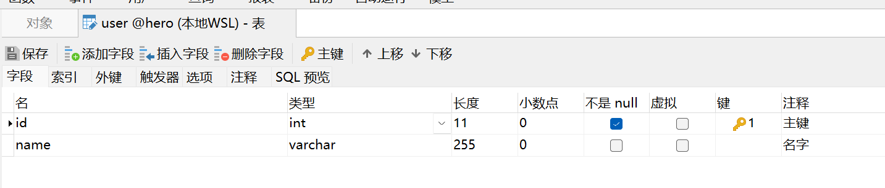

## 本项目可以让 Jpa 自动建表的时候在数据库中添加注释。

### 为什么做这件事

过去想要让 Jpa 在建表的时候自动添加注释一般需要使用 Column#columnDefinition 属性。示例如下：

~~~java
@Column(columnDefinition = "INT COMMENT '...'")
private int unitId;
~~~

但是这样做有如下几个问题：

1. 编写麻烦。需要将 Sql 片段写入到注解中。
2. 维护成本高。在做数据库迁移的时候很可能遇到 Sql 不兼容的问题。

为了解决以上问题所以开发了这个小工具。

### 这个工具的优势

1. 配置简单。只需简单的几步配置就可以完美集成。
2. 适配多种数据库。充分利用 Jpa 的特性，一次配置到处运行，在做数据库迁移时不必为 Sql 不兼容而烦恼。

### 使用方式

#### 添加依赖

~~~xml

<dependency>
    <groupId>com.github.biyanwen</groupId>
    <artifactId>jpa-comment-spring-boot-starter</artifactId>
    <version>1.0.1</version>
</dependency>>
~~~

#### 使用注解

本项目使用 swagger 进行配置 ApiModel#description 注解会生成表的注释。 ApiModelProperty#value 注解会生成字段注释（这个注解既可以放在字段上，也可以放在 get 方法上）。

~~~java

@Entity
@Table(name = "USER")
@Data
public class User {
	@Id
	@GeneratedValue(strategy = GenerationType.AUTO)
	@Column(name = "ID")
	@ApiModelProperty(value = "主键")
	private Integer id;
	@Column(name = "NAME", length = 255)
	@ApiModelProperty(value = "名字")
	private String name;
}
~~~

### 开启自动建表配置

~~~properties
spring.jpa.hibernate.ddl-auto=update
~~~

### 结果展示

ps: 只有新建表或者字段的时候才会有效哦！因为只有新建表或者字段的时候才会触发 Jpa 自动建表/字段的功能。
